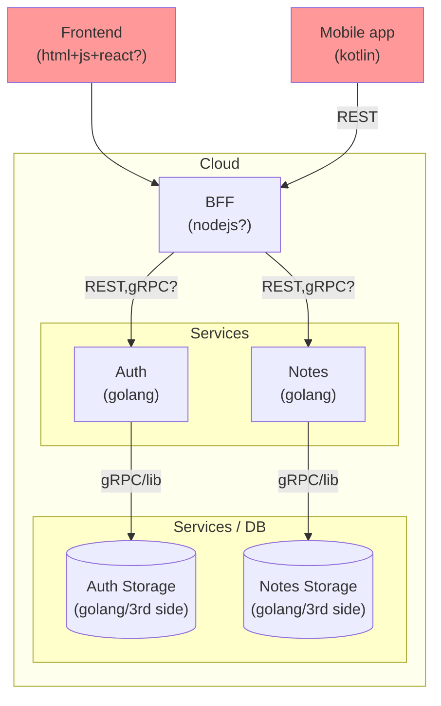

## Notes SaaS

This is a collection of small and simple learning pet projects.

The entire Notes Service (SaaS) as a whole is an analogue of the ToDo training task.

Basic goals / user stories:
1. Notes are folded into books (notebooks).
2. Notes have a custom structure that is common within the same book.
3. (task with an asterisk) Books can be put into bags (notebooks bags)

Inspiration can be drawn from projects such as [Notion](https://www.notion.so).

Subproject learning patterns:
- Html + javascript
    - Html layouting + javascript + react,
    - Javascipt + nodejs development pipelines
    - Javascript REST API
    - JWT/Bearing tokens workout in js
- Kotlin/android modern practices
    - modern layouting
    - REST API
    - background services / worker manager
- Golang
    - Set of services
    - Separate auth pattern
    - JWT/Bearing tokens workout in golang
    - Scaling-ready architecture

## Thoughts

## Prerequisites

Tools / Env.

## License

MIT
(TODO: add license file)

## Colab

Ask me.
