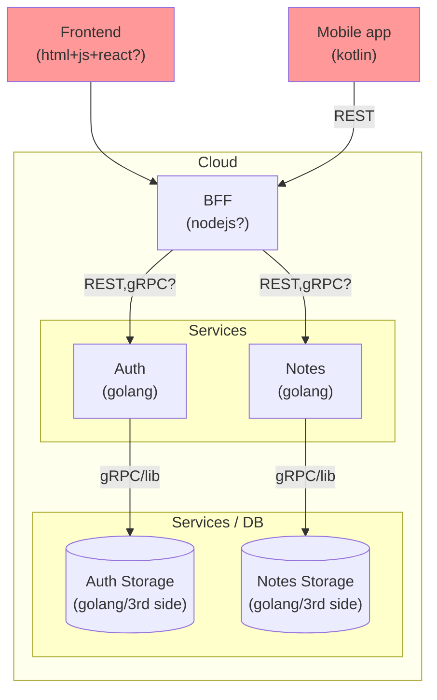

## Notes SaaS

This is a collection of small and simple learning pet projects.

Learning patterns:
- Html + javascript
    - Html layouting + javascript + react,
    - Javascipt + nodejs development pipelines
    - Javascript REST API
    - JWT/Bearing tokens workout in js
- Kotlin/android modern practices
    - modern layouting
    - REST API
    - background services / worker manager
- Golang
    - Set of services
    - Separate auth pattern
    - JWT/Bearing tokens workout in golang
    - Scaling-ready architecture

## Thoughts

## Refs
- mermaid docs https://mermaid-js.github.io/mermaid/#/
