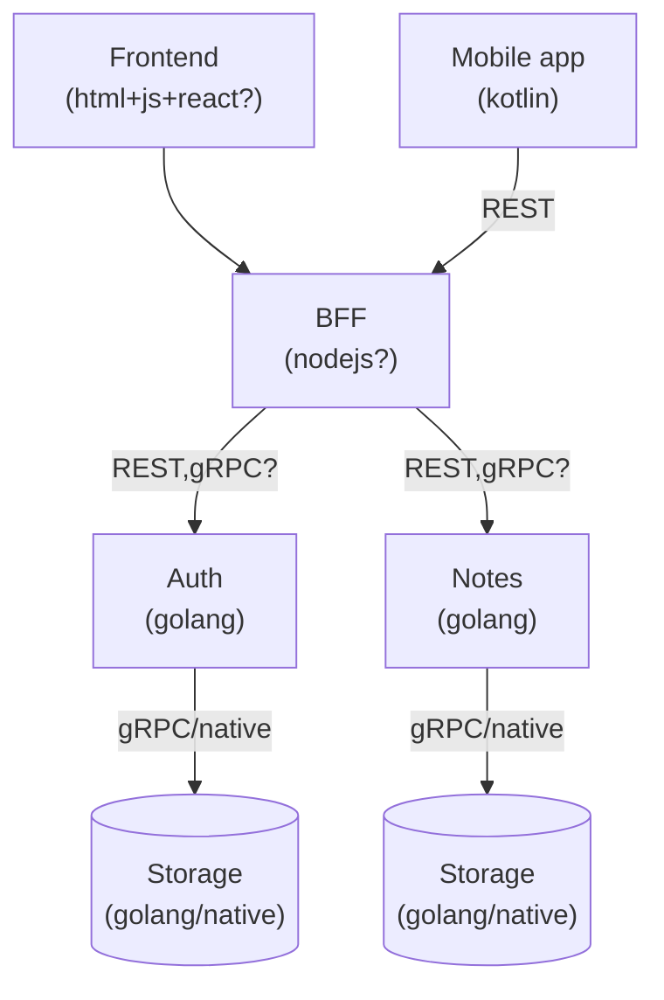

## Notes SaaS

```mermaid
graph TD
    F["Frontend<br/>(html+js+react?)"] --> B["BFF<br/>(nodejs?)"]
    K["Mobile app<br/>(kotlin)"] --> |REST| B
    B --> |REST,gRPC?| A["Auth<br/>(golang)"]
    B --> |REST,gRPC?| N["Notes<br/>(golang)"]
    A --> |gRPC/native| S1[("Storage<br/>(golang/native)")]
    N --> |gRPC/native| S2[("Storage<br/>(golang/native)")]
```

## Refs
- mermaid docs https://mermaid-js.github.io/mermaid/#/
